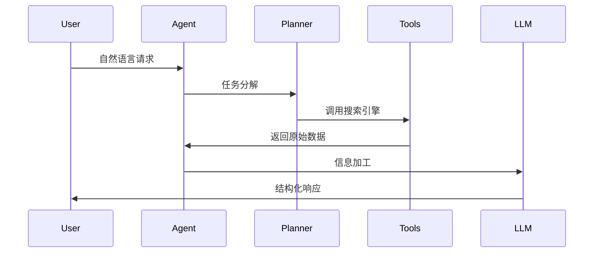

# 小白入门人工智能扫盲手册

#####                                                                                                                                                                                 顾学长，庄学姐，蔡学姐  ·  著

###### 想了解人工智能但不知道从哪里入手，听别人聊天的时候只会阿巴阿巴似懂非懂，这篇文章帮助你梳理了热门的一些词汇希望能帮助你扫盲


（如果内容有表达错误，欢迎联系我修改）

# **基础理论与工具链（学前班）**

#### 1. **数学与编程基础**（打地基篇）

##### 	**1.1 线性代数基础**（机器学习数学基础）


**猜你们大多数学线代都在摸鱼，顺境听课，逆境宋浩，绝境猴博士。**

*线性代数是机器学习和深度学习的基础，主要涉及矩阵的运算和特征值分解。在AI中，矩阵运算用于数据表示和计算优化，例如在神经网络的前向传播和反向传播过程中，矩阵乘法和加法是常见的操作。特征值分解在降维和数据压缩中也起着重要作用。*

##### 	**1.2 概率统计基础**

##### 过年的时候和朋友去打麻将，你把纸和笔掏出来，别人信玄学，你信数学


概率统计帮助我们从数据中提取信息，并作出预测。贝叶斯网络是一种有向图模型，能够表示条件依赖关系，常用于分类问题。马尔可夫链则帮助我们建模时间序列数据，通过当前状态预测下一时刻的状态，是强化学习和自然语言处理中的常用方法。

##### 	**1.3 微积分基础**（这个真要好好学，用得上）


微积分主要用于优化算法，尤其是梯度下降法。梯度下降法是优化模型参数的核心算法，通过计算损失函数相对于模型参数的梯度，逐步调整参数以最小化误差。

#### 2.**编程能力**

**（代码能力还是很重要的，别就会装个IDE，vscode里七七八八的ai写代码插件装一大堆，自己就会写个print “hello world”）**

​	**2.1 Python生态**

**学习python还是比较推荐系统学一下，例如b站的黑马程序员，也不要脑子一热花一万多去报个班，没必要**

Python是AI领域中最常用的编程语言，因其简洁易学且拥有强大的数据处理库。NumPy和Pandas分别用于高效的数值运算和数据处理，而PyTorch和TensorFlow是深度学习框架，它们支持模型训练和推理任务。

- ##### **PyTorch vs TensorFlow 总结对比**

  | **特性**         | **PyTorch**                      | **TensorFlow**                     |
  | ---------------- | -------------------------------- | ---------------------------------- |
  | **计算图**       | 动态计算图（即时执行，灵活调试） | 静态计算图（预定义结构，高效优化） |
  | **易用性**       | API简洁直观，适合研究和快速实验  | TensorFlow 2.x + Keras 更易上手    |
  | **性能**         | 训练速度较快（适合小规模实验）   | 分布式训练和大规模部署更优         |
  | **生态系统**     | 研究社区活跃（如Hugging Face）   | 工业级工具链完善（TFX, Lite, JS）  |
  | **可视化工具**   | 依赖TensorBoard                  | 自带TensorBoard                    |
  | **部署支持**     | TorchServe（较新）               | TF Serving（成熟稳定）             |
  | **主要适用场景** | 研究、NLP、动态模型              | 生产环境、移动端、浏览器端         |

  **2.2 C++嵌入式开发**

  **（我们平时还是c用的多，但c++也很重要，可以了解一下语法，看具体项目需求）**

  C++广泛应用于嵌入式系统开发，在AI硬件控制中尤为重要。通过C++编程，可以实现对传感器、执行器等硬件的实时控制，为AI模型提供必要的数据输入和反馈。

  ##### **2.3 CUDA并行计算**
  
  CUDA技术通过GPU加速计算，为AI训练和推理提供强大的并行计算能力。通过利用GPU处理大量数据，深度学习模型的训练速度得到了显著提升，尤其是在图像处理和视频分析中。

#### 3.**工具链**

##### 	**3.1 Git版本控制**（你要是敢把代码搞丢了 你就完蛋了！）


**版本管理真的很重要，keil的工程文件git配置可能确实比较麻烦，但git是每个软件师傅必须会的**

Git是管理代码版本和协作开发的重要工具。通过Git，可以轻松地管理代码的更新历史，合并不同开发者的修改，并能够在多个版本之间切换，确保代码的可追溯性。

##### 	**3.2 Docker容器化部署**（一杯茶，一包烟，一个环境配一天）


**在实际项目中，有些环境真是及其刁钻，Docker is all you need**

Docker是一种容器化技术，帮助开发者创建一致的开发和生产环境。通过Docker，AI应用可以轻松部署并在不同系统间迁移，减少环境配置的依赖问题。

##### 	**3.3 Jupyter Notebook交互开发**

Jupyter Notebook是一个交互式的开发环境，特别适用于数据分析和机器学习模型的实验。它支持Python代码执行、可视化和文档编写，帮助开发者快速原型和调试。

------


# **机器学习与深度学习（小学一年级）**


#### 1. **经典算法**

##### 	**1.1 监督学习**

**用标注数据训练模型就像教鹦鹉背单词——背得好给瓜子（损失函数降低），背错了饿肚子（梯度更新)**

 监督学习是最常见的机器学习任务，利用标注数据训练模型，常见算法包括支持向量机（SVM）和XGBoost。SVM用于分类任务，通过最大化类别间的间隔来提高模型的泛化能力。XGBoost则是一种基于梯度提升决策树（GBDT）的集成方法，广泛应用于结构化数据的预测。

##### 	**1.2 无监督学习**

**K-Means聚类就像大妈跳广场舞——自动分成红扇子队和绿绸带队（虽然大妈自己也不知道为啥）**

 无监督学习用于数据中没有标注信息的情况，常见算法包括K-Means聚类和主成分分析（PCA）。K-Means用于将数据划分为不同的簇，PCA则用于降维，将高维数据映射到低维空间，帮助去除冗余信息并提高计算效率。

##### 	**1.3 强化学习**

**Q-Learning就像迷宫找糖吃——撞墙扣分（负奖励），找到出口给大奖（Q值更新）**

 强化学习通过智能体与环境的互动进行学习，Q-Learning和PPO是常见的算法。Q-Learning通过更新Q值来学习最优策略，而PPO则是一种改进的策略梯度方法，广泛用于控制和机器人领域。


**三大机器学习范式对比**

|   **特性**   | **强化学习 (Reinforce Learning)** |     **监督学习 (Supervised Learning)**     |  **无监督学习 (Unsupervised Learning)**  |
| :----------: | :-------------------------------: | :----------------------------------------: | :--------------------------------------: |
| **核心思想** |  Agent通过试错与环境交互获取奖励  |     从已标注数据中学习输入到输出的映射     |     从未标注数据中发现隐藏模式或结构     |
| **数据要求** | 不需要标注数据，但需设计奖励函数  |           需要大量标注数据 (X→Y)           |          完全无标注数据 (只有X)          |
| **典型算法** |     Q-Learning, DQN, PPO, A3C     | SVM, CNN, Random Forest, Linear Regression |      K-Means, PCA, GAN, Autoencoder      |
| **优化目标** |          最大化累积奖励           |       最小化预测误差 (如交叉熵、MSE)       |     数据压缩/聚类/生成 (如重构误差)      |
| **反馈类型** |      延迟反馈 (稀疏奖励信号)      |       即时明确反馈 (每个样本有标签)        |                无明确反馈                |
| **应用场景** |    AlphaGo, Robotics, Game AI     |   Image Classification, NLP, Prediction    | Customer Segmentation, Anomaly Detection |
| **数据依赖** |         ⭐⭐ (依赖环境设计)         |             ⭐⭐⭐⭐ (需大量标注)              |             ⭐ (仅需原始数据)             |
| **计算成本** |         ⭐⭐⭐⭐ (需大量交互)         |                     ⭐⭐                     |                    ⭐                     |

---

**通俗理解**

1. *监督学习* 👉 *老师教学生*  
   - *"这张图片是猫，那张是狗"* → *学会分类新图片*

2. *无监督学习* 👉 *自学成才*  
   - *"这里有一堆图片，自己找规律吧"* → *发现图片可分成3类*

3. *强化学习* 👉 *打游戏升级*  
   - *"走这一步得10分，走那一步扣5分"* → *学会如何通关*

---

关键区别

1. *反馈机制*  

   - SL: *每个动作有标准答案*  
   - UL: *没有答案，只有数据*  
   - RL: *只有"好/坏"的模糊评价*

2. *目标导向*  

   - SL/UL: *解决静态问题*  
   - RL: *解决序列决策问题*

3. *数据效率*  

   - RL通常需要比SL更多的数据交互  

   

#### 2. **神经网络架构**

##### 	**2.1 卷积神经网络（CNN）**（图像处理，例如人脸识别）

 CNN是一种用于处理图像数据的神经网络架构，能够自动学习图像中的空间特征。经典架构如ResNet通过引入残差连接解决了深层网络中的梯度消失问题，YOLOv8则是一个用于目标检测的CNN架构，通过端到端的训练实现快速且准确的目标定位。

##### 	**2.2 循环神经网络（RNN）**（记不住东西，但消耗资源少，可以轻量化部署，也有家公司开发了RNN变种架构：RWKV）

 RNN用于处理时间序列数据，能够保留前一时刻的信息。LSTM和GRU是RNN的变种，能更好地解决长时间依赖问题，广泛应用于语音识别、自然语言处理等领域。

##### 	**2.3 Transformer与自注意力机制**（

 Transformer是目前最主流的自然语言处理架构，基于自注意力机制，可以高效地处理长文本的依赖关系。自注意力机制允许每个单词在上下文中直接与其他单词进行交互，显著提升了处理大规模文本的能力。

**下面这篇公众号讲的比较详细**

[一文快速预览经典深度学习模型——CNN、RNN、LSTM、Transformer、ViT](https://mp.weixin.qq.com/s?__biz=MzkwMDQ0NjY4NQ==&mid=2247485992&idx=1&sn=d782742e4afbd50143525468e3311f2c&chksm=c110e67b3614e81c671b3cac3a98988c12950fc1cb8cda54b8df92aa0297833151bc69079438&mpshare=1&scene=1&srcid=0514zJrUnIdyz0jAzB2ovWkx&sharer_shareinfo=9f2d102ce70fb6dd64a37dee09aa6c66&sharer_shareinfo_first=9f2d102ce70fb6dd64a37dee09aa6c66)


以下是合并后的综合对比表格，涵盖核心结构、工作原理与应用场景：

---

###### **CNN、RNN、Transformer全面对比表**

| **维度**           | **CNN (卷积神经网络)**                    | **RNN (循环神经网络)**                 | **Transformer**                            |
| ------------------ | ----------------------------------------- | -------------------------------------- | ------------------------------------------ |
| **核心结构**       | • 卷积层+池化层<br>• 局部滑动窗口         | • LSTM/GRU单元<br>• 时间步递归连接     | • 编码器-解码器<br>• 多头自注意力+位置编码 |
| **工作原理**       | • 卷积核共享参数<br>• 逐层提取局部特征    | • 隐状态传递时序信息<br>• 顺序串行计算 | • 全局注意力动态加权<br>• 并行计算全序列   |
| **时序建模能力**   | ❌ 无原生时序支持                          | ✅ 隐状态捕获时序关系                   | ⚠️ 需外置位置编码                           |
| **长距离依赖处理** | ❌ 依赖深层网络间接捕获                    | ⚠️ LSTM/GRU部分缓解                     | ✅ 单层注意力直接建模全局关系               |
| **并行计算能力**   | ✅ 卷积操作高度并行                        | ❌ 必须顺序执行                         | ✅ 全序列并行处理                           |
| **典型应用场景**   | • 图像分类/分割（ResNet）<br>• 视频帧分析 | • 短文本生成<br>• 实时传感器数据处理   | • 机器翻译（BERT/GPT）<br>• ViT图像分类    |
| **硬件适配性**     | ✅ GPU/TPU高效加速                         | ❌ GPU利用率低                          | ✅ GPU友好但显存消耗大                      |
| **内存效率**       | ✅ 参数共享降低内存占用                    | ⚠️ 中等（隐状态缓存）                   | ❌ $O(n^2)$注意力矩阵限制长序列             |
| **优势场景案例**   | • Edge设备图像识别（轻量化CNN）           | • ICU患者实时监测（LSTM）              | • ChatGPT对话系统<br>• DALL-E图像生成      |

---

**关键结论**

1. **结构决定能力**：CNN的局部感知 vs RNN的时序递归 vs Transformer的全局交互  

2. **场景适配原则**：  
   - *局部网格数据* → CNN  
   - *短序列实时任务* → RNN变体  
   - *长序列复杂语义* → Transformer  

3. **趋势冲突点**：Transformer虽强，但在边缘计算场景仍难替代轻量化CNN。

   

#### 3. **多模态学习**

##### 	**3.1 CLIP图文对齐**

 CLIP模型将图像与文本结合，通过共同的特征空间实现图文匹配。这使得AI能够理解和生成符合文本描述的图像，广泛应用于图像搜索、内容生成等任务。


##### 	**3.2 Flamingo视频语言模型**

 Flamingo模型结合视频和语言的特征，能够对视频内容进行分析并生成描述。这对于动态场景下的理解尤为重要，例如视频中的动作识别和事件预测。

##### 	**3.3 Stable Diffusion图像生成**

 Stable Diffusion是一种生成对抗网络（GAN）模型，能够根据文本描述生成逼真的图像。它在艺术创作、游戏设计和广告制作等领域具有巨大的应用潜力。


##### 看到这里  有多少同学已经快睡着了


# 人工智能前沿技术体系解析（小学二年级）  

——从AI Agent到RAG的认知革命  

---

## **1. AI Agent：智能体的认知革命**  


### **1.1 核心定义**  

**"会思考的AI员工"**：AI Agent是具有自主感知-决策-行动能力的智能体，能通过工具调用与环境持续交互。其本质是构建**可执行复杂任务的认知架构**  


#### **关键技术栈**  
1. **感知模块**  
   - 多模态输入处理 (文本/图像/语音→向量编码)  
   - 环境状态建模 (马尔可夫决策过程MDP)  

2. **记忆机制**  
   - 短期记忆 (对话历史缓存)  
   - 长期记忆 (向量数据库+知识图谱)  

3. **推理引擎**  
   ```python  
   # 基于ReAct框架的决策流程  
   def react_loop(observation):  
       while not task_done:  
           thought = llm.generate(f"当前状态：{observation}")  
           action = parse_action(thought)  
           observation = execute(action)  
   ```

4. **工具调用**  
   - API调用规范 (OpenAI Function Calling)  
   - 工具注册中心 (LangChain Tools Registry)  

---


## **2. MCP：标准化模型-工具调用协议**  


**MCP（Model Context Protocol）** 提供统一协议，让语言模型调用任何外部工具成为可能。


- 系统组成：
  - Host：语言模型运行环境（如 VSCode、Notebook）。
  - Client：转发模型意图，封装为标准调用请求。
  - Server：管理模块调用、权限检查与结果响应。
  - Module：注册的工具组件，每个定义输入、输出、权限。
- 调用流程细化：
  1. 模型输出调用意图（如：调用“find_file”模块）。
  2. MCP Client 解析结构化请求。
  3. MCP Server 检查权限并调用本地/远程模块。
  4. 返回执行结果嵌入模型上下文。
- 安全与可扩展机制：
  - 权限令牌：不同用户或Agent访问不同模块权限。
  - 沙箱机制：隔离模块运行空间，防止代码泄露与越权。
  - 模块市场：支持插件式模块共享与注册。

---

## **3. RAG：检索增强生成**  
###   3.1 技术原理  
**Retrieval-Augmented Generation** 通过将外部知识检索与LLM生成结合，解决大模型幻觉问题  


#### **关键创新点**  
| 组件     | 传统方法       | RAG改进              |
| -------- | -------------- | -------------------- |
| 检索器   | BM25关键词匹配 | 稠密向量检索 (DPR)   |
| 知识库   | 静态文档库     | 动态更新的向量数据库 |
| 融合方式 | 简单拼接       | 注意力机制重排序     |

#### **优化策略**  
1. **混合检索**  
   - 关键词检索 (ElasticSearch) + 向量检索 (FAISS) 联合召回  
2. **结果增强**  
   ```python  
   def hybrid_retrieval(query):  
       bm25_results = elastic_search(query)  
       vector_results = faiss_search(query_embedding)  
       reranked = cross_encoder.rerank(query, bm25+vector)  
       return reranked[:5]  
   ```

---

## **4. LangChain：智能体开发框架**  
### **4.1 架构设计哲学**  
**"AI应用的乐高积木"**：通过模块化组件实现复杂AI工作流的快速编排  

#### **核心组件矩阵**  
| 模块   | 功能        | 典型实现                 |
| ------ | ----------- | ------------------------ |
| Models | 接入各类LLM | OpenAI, Anthropic, Llama |
| Chains | 任务流水线  | LCEL表达式语言           |
| Memory | 状态保持    | ConversationBufferWindow |
| Agents | 智能决策    | ReAct, Self-Ask          |
| Tools  | 能力扩展    | PythonREPL, GoogleSearch |

#### **典型应用模式**  


---

## **5. Llama Index：数据增强引擎**  
### **5.1 技术定位**  
**"私有数据的神经接口"**：为LLM构建高效的数据检索与增强管道  

#### **核心功能矩阵**  
| 层级     | 功能       | 技术实现            |
| -------- | ---------- | ------------------- |
| 数据连接 | 多源接入   | 支持DB/API/文件系统 |
| 索引构建 | 知识组织   | 向量索引+图索引混合 |
| 查询优化 | 精准检索   | 查询路由+结果重排   |
| 增强处理 | 上下文扩充 | Prompt工程模板      |

#### **性能优化策略**  
1. **分层索引**  
   - 元数据过滤 → 向量检索 → 精排的三级漏斗  
2. **增量更新**  
   - 基于HNSW的在线索引更新  
3. **缓存机制**  
   - LRU缓存高频查询结果  

---

## **技术体系对比**  
| 维度     | AI Agent     | MCP          | RAG          | LangChain    | Llama Index  |
| -------- | ------------ | ------------ | ------------ | ------------ | ------------ |
| 核心目标 | 自主任务执行 | 多智能体协作 | 知识增强生成 | 应用快速开发 | 数据接入增强 |
| 关键技术 | 强化学习     | 分布式优化   | 稠密检索     | 链式编排     | 混合索引     |
| 数据依赖 | 环境交互     | 联合建模     | 外部知识库   | 工具集成     | 私有数据源   |
| 典型场景 | 虚拟助手     | 供应链优化   | 智能客服     | 自动化流程   | 企业知识库   |

---

## **技术演进趋势**  
1. **认知架构融合**：Agent+ RAG + LangChain构建完整认知闭环  
2. **多模态突破**：视觉-语言-行动的多模态联合建模  
3. **分布式协作**：联邦学习赋能跨组织Agent协作  
4. **实时性增强**：流式数据处理与增量学习  

> **技术哲学思考**：当前AI技术正在从"单一模型能力"向"系统智能工程"演进，构建可解释、可协作、可持续进化的智能系统将成为下一代AI的核心命题

**可以看一下下面这篇文章**

[AI Agent 的未来是事件驱动的](https://mp.weixin.qq.com/s?__biz=MzI2ODUyMTQyNA==&mid=2247496747&idx=1&sn=a7a16bbb0ecfa9999c5231d9137dceba&chksm=ebaa3a9a29879a9f5e1b27f121b0fa0cf3d34656e9fed849f1914d153251ab9b0fd7a17334a3&mpshare=1&scene=1&srcid=0514idJmKxIR9SD9LeHylODy&sharer_shareinfo=696f4a33f11d460a4230253fa196b07b&sharer_shareinfo_first=696f4a33f11d460a4230253fa196b07b)


#  人工智能基石（小学三年级）

###### —— CPU，GPU，NPU

------

#### AI Agent 系统的部署需要考虑计算资源的选型，选择适当的计算单元（CPU、GPU、NPU）对于提升系统性能和节省资源至关重要。每种计算资源在不同任务和应用场景中的选择直接影响AI系统的效率、功耗和响应时间。


- **CPU**：通用处理单元，适合处理逻辑控制、串行任务，在模型推理不涉及大规模矩阵计算时，CPU 是一种合适的选择。CPU 的优势在于其高度的通用性和灵活性，能够在各种任务中发挥作用。对于执行一些任务调度、模型控制、数据预处理和管理等任务时，CPU 具备较低的开发复杂度和易用性。CPU 主要用于语言模型的任务调度和记忆管理（如 LangChain 的任务流控制）。
  
  - **使用场景**：CPU 适合负载较轻的任务，如信息查询、数据管理、控制流程、处理较小规模的数据集。更具体地说，在 LangChain 系统中，CPU 常被用作处理任务流控制、决策制定和输出整合的组件。
  - **优缺点**：CPU 的主力作用体现在串行任务上，但在大规模并行任务和高计算密集型应用中，速度相对较慢，难以应对复杂的训练和推理任务。
  
- **GPU**：GPU（图形处理单元）具有强大的并行计算能力，尤其在进行深度学习模型训练和大规模矩阵计算时表现出色。其在图像、视频、自然语言处理任务中得到了广泛应用。GPU 利用其成百上千个核心，可以同时处理成千上万的计算任务，极大加速深度学习训练和推理过程。尤其在需要进行大规模矩阵运算（如卷积神经网络CNN或变换器模型Transformer）时，GPU 能显著缩短时间，提高效率。

  

  - **使用场景**：GPU 是进行深度学习训练、图像处理、视频推理、大规模数据集处理等计算密集型任务的理想选择。在 LangChain 或 RAG 系统中，GPU 经常被用于加速模型的训练和推理阶段，尤其是在处理图像、文本、视频生成等多模态任务时。
  - **优缺点**：GPU 适合高吞吐量的并行计算任务，能够提供高效的推理和训练速度，但其功耗较高，体积较大，并且在执行轻量级任务时可能不如 CPU 高效。

- **NPU**：NPU（神经网络处理单元）是一种专为深度学习推理任务设计的硬件加速器，具备高效低功耗的优势。NPU 在边缘计算设备中尤其重要，它能够为设备提供快速的推理能力，同时保持较低的能耗，这对于需要长期运行且对功耗敏感的设备（如智能手机、物联网设备、智能摄像头）至关重要。NPU 通常在边缘推理系统中作为加速单元，适用于深度学习模型的推理计算，尤其是对于实时处理的需求。
  
  - **使用场景**：NPU 特别适用于需要在边缘设备上执行推理任务的场景，例如物联网设备、智能终端、摄像头、自动驾驶系统等。它适合在需要低延迟和高效计算的应用场景下使用。
  - **优缺点**：NPU 提供了极低的功耗和高效的推理能力，能够在移动设备和边缘设备上进行大规模推理计算。然而，NPU 的可编程性较低，开发者需要根据特定平台的硬件支持进行优化。

###### 计算单元对比：

| 计算单元 | 优势                                                         |                     劣势                     |                        推荐使用场景                        |
| -------- | ------------------------------------------------------------ | :------------------------------------------: | :--------------------------------------------------------: |
| **CPU**  | 通用性强，易用性高，适合处理串行任务和控制逻辑               |    计算速度较慢，不适合大规模并行计算任务    |       任务调度、数据预处理、模型小型化任务、逻辑控制       |
| **GPU**  | 强大的并行计算能力，适合大规模计算任务，尤其是深度学习训练和推理 |     功耗较高、体积较大，不适合轻量级任务     | 大规模训练、图像处理、视频推理、深度学习模型训练、推理加速 |
| **NPU**  | 低功耗、高效，适合边缘设备和实时推理任务，特别是在长时间、高频率推理任务中的优势 | 可编程性较低，适用于深度学习推理而非通用计算 |  物联网设备、智能终端、嵌入式设备推理、低功耗边缘推理任务  |


### **NPU（Neural Processing Unit，神经网络处理器）详解**

#### **1. NPU 的核心定义与定位**
- **本质**：专为人工智能（AI）任务设计的专用处理器，针对神经网络计算的**矩阵运算、并行计算、低精度推理**等场景优化。
- **与传统处理器的区别**：
  - **CPU**：通用性强，但并行计算能力弱，能效比低。
  - **GPU**：擅长并行浮点运算，但功耗高，架构冗余（如为图形渲染设计的固定管线）。
  - **NPU**：硬件级定制化，直接映射神经网络算子（如卷积、激活函数），通过**硬件加速器+指令集协同**实现高效能。

---

#### **2. NPU 诞生的技术驱动力**
- **AI 计算需求爆炸**：神经网络参数量（如GPT-3达1750亿）与数据量激增，传统算力无法满足实时性要求。
- **能效瓶颈**：AI训练/推理的功耗成本过高（如GPU集群耗电达兆瓦级），需专用硬件提升能效比（TOPS/W）。
- **算法与硬件协同设计**：神经网络结构（如CNN、Transformer）的固定计算模式，为硬件定制化提供可能。

---

#### **3. NPU 核心架构设计**
- **计算单元设计**：
  - **矩阵乘加引擎**：针对卷积、全连接层的大规模矩阵运算，采用脉动阵列（Systolic Array）或并行MAC单元。
  - **稀疏计算优化**：支持权重/激活稀疏化（如剪枝后的非零元素跳过计算）。
  - **混合精度支持**：INT8/INT4低精度计算单元，兼顾推理速度与精度损失。
- **存储架构**：
  - **片上缓存分级**：多级SRAM/寄存器堆，减少外部DRAM访问延迟。
  - **数据重用策略**：通过数据局部性优化（如Winograd变换）降低内存带宽需求。
- **数据流控制**：
  - **数据驱动架构**：采用数据流（Dataflow）模型，减少指令译码开销。
  - **动态调度**：硬件级任务调度器，自动分配计算资源（如MAC单元、内存带宽）。
- **能效优化技术**：
  - **近内存计算（Near-Memory Computing）**：减少数据搬运能耗。
  - **电压/频率动态调节**：根据负载调整功耗（如DVFS技术）。

---

#### **4. NPU 关键技术特性**
- **量化与压缩**：
  - **训练后量化（PTQ）**：将FP32模型转换为INT8/INT4，硬件直接支持低精度计算。
  - **权重编码**：哈夫曼编码/游程编码（RLE）压缩稀疏权重。
- **稀疏性加速**：
  - **零值跳过（Zero-Skipping）**：通过硬件标志位跳过零值乘加操作。
  - **结构化稀疏**：硬件支持块稀疏（Block Sparsity）模式。
- **硬件-软件协同**：
  - **编译器优化**：将神经网络模型（如ONNX、TensorFlow）编译为NPU指令（如华为昇腾的CANN编译器）。
  - **算子融合**：合并多个算子（如Conv+ReLU+Pooling）减少中间数据存储。

---

#### **5. NPU 应用场景与典型产品**
- **云端推理/训练**：
  - **案例**：谷歌TPU v4（4096芯片互联，支持千亿参数模型训练）、华为昇腾910。
  - **需求**：高吞吐量、低延迟、多模型并发。
- **边缘计算**：
  - **案例**：高通Hexagon NPU（手机端AI摄影）、寒武纪MLU220（智能摄像头）。
  - **需求**：低功耗（<10W）、实时性（如30fps目标检测）。
- **自动驾驶**：
  - **案例**：特斯拉FSD芯片（72TOPS，支持BEV感知网络）。
  - **需求**：功能安全（ASIL-D）、多传感器融合计算。

---

#### **6. NPU 技术挑战与未来趋势**
- **挑战**：
  - **算法演进适配**：新型网络结构（如MoE、RetNet）对硬件灵活性要求提高。
  - **软件生态碎片化**：不同厂商NPU指令集/工具链不兼容（如英伟达CUDA生态垄断）。
  - **制程限制**：3nm以下工艺成本激增，需依靠架构创新突破算力天花板。
- **未来方向**：
  - **存算一体（CIM）**：在存储器内直接计算（如RRAM/PCM），突破“内存墙”。
  - **3D堆叠封装**：通过chiplet技术提升集成度（如台积电CoWoS）。
  - **类脑计算**：脉冲神经网络（SNN）与神经拟态芯片（如Intel Loihi 3）。

---

#### 7. NPU vs. GPU vs. FPGA
| **特性**     | **NPU**                | **GPU**        | **FPGA**            |
| ------------ | ---------------------- | -------------- | ------------------- |
| **计算效率** | 专用指令集，能效比最高 | 高并行但功耗大 | 可编程，效率中等    |
| **灵活性**   | 固定模型加速           | 通用并行计算   | 硬件可重构          |
| **典型延迟** | 纳秒级（推理优化）     | 微秒级         | 微秒级              |
| **适用场景** | 终端推理/云端训练      | 训练/科学计算  | 原型验证/小批量部署 |

---

#### **总结**
NPU 是AI计算从“通用”走向“专用”的必然产物，其核心价值在于**通过架构创新匹配算法特性**，突破“内存墙”与“功耗墙”。未来，随着算法-硬件协同设计（如Transformer专用NPU）、先进封装与新材料（如碳纳米管）的应用，NPU将成为AI基础设施的核心算力载体。

###### 各个公司NPU研发对比

| 公司名称       | 产品名称                            | NPU类型                                         | 主要应用领域                                             |
| :------------- | :---------------------------------- | :---------------------------------------------- | :------------------------------------------------------- |
| 阿里巴巴达摩院 | 含光800                             | 神经网络处理器                                  | 图像视频分析、机器学习等AI推理计算                       |
| 爱芯元智       | 爱芯通元混合精度NPU                 | 混合精度NPU                                     | 消费级AI产品研发                                         |
| 寒武纪         | Cambricon-1M系列                    | 神经网络处理器                                  | 高性能、低功耗的人工智能视觉处理器芯片                   |
| 旷视           | 鸿图系列                            | 神经网络处理器                                  | 智能驾驶、物联网、云计算等                               |
| 联发科         | 天玑9300                            | 神经网络处理器                                  | 高性能、低功耗的人工智能视觉处理器芯片                   |
| 紫光展锐       | V8821                               | 神经网络处理器                                  | 高性能、低功耗的人工智能视觉处理器芯片                   |
| 亿铸科技       | 存算一体AI大算力芯片                | 存算一体NPU                                     | 高性能、低功耗的人工智能视觉处理器芯片                   |
| 黑芝麻智能     | 华山系列                            | 神经网络处理器                                  | 高性能、低功耗的人工智能视觉处理器芯片                   |
| 后摩智能       | 后摩鸿途H30                         | 神经网络处理器                                  | 高性能、低功耗的人工智能视觉处理器芯片                   |
| 墨芯人工智能   | Antoum芯片                          | 神经网络处理器                                  | 高性能、低功耗的人工智能视觉处理器芯片                   |
| 清微智能       | TX8系列                             | 神经网络处理器                                  | 高性能、低功耗的人工智能视觉处理器芯片                   |
| 芯驰科技       | X9-舱之芯                           | 神经网络处理器                                  | 高性能、低功耗的人工智能视觉处理器芯片                   |
| 芯擎科技       | 龍鹰一号座舱芯片                    | 神经网络处理器                                  | 高性能、低功耗的人工智能视觉处理器芯片                   |
| 英特尔         | NPU 4                               | 神经网络处理器                                  | AI处理                                                   |
| AMD            | XDNA 2                              | 神经网络处理器                                  | AI处理                                                   |
| 高通           | Snapdragon X Elite                  | 神经网络处理器                                  | AI处理                                                   |
| 炬芯科技       | ATS286X                             | CPU+DSP+NPU三核异构                             | 高端AI音频芯片                                           |
| 恒玄科技       | 带有图形NPU功能的芯片               | 图形NPU                                         | 集成NPU领域                                              |
| 国芯科技       | -                                   | -                                               | GPU和NPU等技术的研发和应用                               |
| 芯原股份       | -                                   | -                                               | GPU/NPU等推动IP业务增长                                  |
| 九联科技       | 信创智算产品                        | 华为自研NPU                                     | 华为盘古大模型边缘端侧的算力底座                         |
| 瑞芯微         | 新推出的SoC                         | 自研NPU                                         | 智能化、算力需求                                         |
| 翱捷科技       | 首款智能IPC芯片                     | NPU引擎设计技术                                 | 支持多种神经网络，具备2.5Tops算力和2Tops神经网络运算性能 |
| 美格智能       | 算力模组                            | CPU/GPU/NPU等多种计算单元                       | 集成多种计算单元                                         |
| 智微智能       | AI服务器和AIBOX边缘设备             | 基于GPU、多家ASIC AI加速卡、ARM NPU的多系列产品 | AI服务器和边缘设备                                       |
| 创维数字       | -                                   | -                                               | NPU边缘计算                                              |
| 四维图新       | 新一代座舱芯片                      | 集成神经网络加速单元NPU                         | 新一代座舱芯片                                           |
| 广电运通       | “端-边云”系列产品                   | RISC通用架构处理器+AI芯片(NPU、TPU)             | “端-边云”系列产品                                        |
| 全志科技       | 高性能视觉处理Soc芯片               | 基于NPU加速的高性能视觉处理Soc芯片              | 高性能视觉处理Soc芯片                                    |
| 国科微         | -                                   | 前端IPC最高4T算力和后端NVR/DVR 9T算力           | IPC和NVR/DVR                                             |
| 北京君正       | T40、T41、A1等芯片                  | NPU技术已应用于T40、T41、A1等芯片中             | T40、T41、A1等芯片                                       |
| 昆仑万维       | 可编程的、高性能的NPU产品           | 可编程的、高性能的NPU产品                       | 模型训练及推理                                           |
| 广和通         | 基于高通QCS8250芯片和软件的AI模组   | 集成高性能NPU的AI模组                           | AI模组                                                   |
| 东士科技       | 多款边缘计算服务器                  | 覆盖从3TOPS至130TOPS范围的算力                  | 边缘计算服务器                                           |
| 安联锐视       | 嵌入式芯片平台内置NPU赋能各类AI场景 | 嵌入式芯片平台内置NPU                           | 各类AI场景                                               |
| 云天励飞       | 自研SOC芯片搭载新一代NPU            | 新一代NPU                                       | 自研SOC芯片                                              |

[AI时代，万能芯片FPGA的出路在哪？【极度硬核】_哔哩哔哩_bilibili](https://b23.tv/GKVrPoK)

[从英伟达CUDA到昇腾CANN，计算架构为何这么重要？_哔哩哔哩_bilibili](https://b23.tv/tU2lRk6)


# 大模型与AI技术学习路径分类指南（课外补习班）

## 一、NLP基础与模型架构演进
### 1.1 基础理论与经典模型
- [从理论到实践：RAG、Agent、微调等6种常见的大模型定制策略](https://mp.weixin.qq.com/s?__biz=MzI2ODUyMTQyNA==&mid=2247496242&idx=1&sn=bc190bedf901dccedc60993f4d5817c5&chksm=eb81d60b0400d37dc7dec1c491033054e10454956d70787a1eeb84bf357262e0df0359e86e77&mpshare=1&scene=1&srcid=0313NoCsdg8gJkw4XYEHv8IL&sharer_shareinfo=80c7e95a59a27ea82944adbb9ca5105e&sharer_shareinfo_first=80c7e95a59a27ea82944adbb9ca5105e)  
- [LLM架构从基础到精通之循环神经网络（RNN）](https://mp.weixin.qq.com/s?__biz=MzkxMDcwMDExOQ==&mid=2247485618&idx=1&sn=d47b475189a4183fe00b295ca9378c82&chksm=c0b964fe48e3c9f6f0ab080546e8bb179ddb4fe1dea066000faeb45742cb3351c8f99debab60&mpshare=1&scene=1&srcid=0313Lm1whdrVvWWfKXTXieRN&sharer_shareinfo=647507f1cc0b2a4a1b1fb9ee1efcc6db&sharer_shareinfo_first=647507f1cc0b2a4a1b1fb9ee1efcc6db)    
- [LLM架构从基础到精通之门控循环单元（GRUs）](https://mp.weixin.qq.com/s?__biz=MzkxMDcwMDExOQ==&mid=2247488921&idx=1&sn=e43a742af5943f119a21682b760252be&chksm=c0c0f79275e3d9dd51a135ea2afc7d32b06d133e112bfac85dcfa6707b1920fae8de75fbd883&mpshare=1&scene=1&srcid=0514PAQsbo25yd4RyToWh1O1&sharer_shareinfo=f1a3750a1c89f9345dddfbf01c0c3c6f&sharer_shareinfo_first=f1a3750a1c89f9345dddfbf01c0c3c6f)  
- **扩展知识点**：  
  - RNN的梯度消失问题与LSTM/GRU的门控机制（遗忘门、输入门、输出门）  
  - 编码器-解码器架构的演进：从Seq2Seq到Transformer  

---

### 1.2 Transformer与注意力机制
- [20000字的注意力机制讲解，全网最全](https://mp.weixin.qq.com/s?__biz=MzkxMDcwMDExOQ==&mid=2247488921&idx=2&sn=92bbce75493c4b618c7efd3f8cbe5f24&chksm=c0f45617707493ebb8ca03a638cf1dd84cd4f7265429da4c9403fe1a234dfc8e9a9638fd6e49&mpshare=1&scene=1&srcid=0514AzHejzih5einyw4dAc3B&sharer_shareinfo=37eee56241b246e7603943d941e2a357&sharer_shareinfo_first=37eee56241b246e7603943d941e2a357)  
- [深入探究编码器 - 解码器架构：从RNN到Transformer的自然语言处理模型](https://mp.weixin.qq.com/s?__biz=MzkxMDcwMDExOQ==&mid=2247488921&idx=3&sn=5217c2e14565eef92174421d8e7bf87d&chksm=c0847fc73dbedc4e1cbfe8120367126ccd042fc7cde0b6b5d7466d91a6c325d04bf0eb528330&mpshare=1&scene=1&srcid=0514Rehk6PcU8RNFK37g7EKi&sharer_shareinfo=55cf40fc7c9dc25abf794c87579e9428&sharer_shareinfo_first=55cf40fc7c9dc25abf794c87579e9428)  
- [2w8000字深度解析从RNN到Transformer：构建NLP应用的架构演进之路](https://mp.weixin.qq.com/s?__biz=MzkxMDcwMDExOQ==&mid=2247486127&idx=1&sn=7bd3b4fe33e6daee5866f81e08d5165b&chksm=c0508e91b63c1ae61de1e81f5c20d0602cedcb4e46a985e19c843181ecbf600acb0d51239138&mpshare=1&scene=1&srcid=0313maxRJfqWZWzqEvkE7EE9&sharer_shareinfo=debb0b589ea39b3d1d30c12753df45c7&sharer_shareinfo_first=debb0b589ea39b3d1d30c12753df45c7)  
- **扩展知识点**：  
  - 自注意力机制（Self-Attention）的计算过程与多头注意力（Multi-Head）  
  - Transformer的位置编码（Positional Encoding）与残差连接  

---

## 二、大模型核心技术组件
### 2.1 词嵌入与表示学习
- [LLM大模型架构之词嵌入（Part1）](https://mp.weixin.qq.com/s?__biz=MzkxMDcwMDExOQ==&mid=2247485149&idx=1&sn=5c76295ac74673126a723c9836b24e3a&chksm=c0ae8f7a45e5b15d41bb97b95e0775a96635eeba3e3e00331c0cc41ad5bf06e609fc362f8bb2&mpshare=1&scene=1&srcid=0514Q1Coo3PwVsvg5GnsjHxq&sharer_shareinfo=2d2a965a827371156f5079f19acdb127&sharer_shareinfo_first=2d2a965a827371156f5079f19acdb127)  
- [LLM大模型架构之词嵌入（Part2）](https://mp.weixin.qq.com/s?__biz=MzkxMDcwMDExOQ==&mid=2247485149&idx=2&sn=b6c19e14630c53a6bbc8c2ef2c6387cf&chksm=c009449ae464af452c4fd50c2ad9c353660e85b90c39f80b27791d6f27b85350bc328f81aaa7&mpshare=1&scene=1&srcid=0514NXjuwnBhvwGYXudmO38c&sharer_shareinfo=695ed74bc8a8acbbe6592815df748075&sharer_shareinfo_first=695ed74bc8a8acbbe6592815df748075)  
- [LLM大模型架构之词嵌入(Part3)](https://mp.weixin.qq.com/s?__biz=MzkxMDcwMDExOQ==&mid=2247488917&idx=1&sn=8e72c1b14835b254fc0b59d468fb2d33&chksm=c0782c67398cb3bff1bee24a16f7c253da26cd67679d93bf495784daea872e6044d8dd05913e&mpshare=1&scene=1&srcid=0514NjEW2sf9tm48l0PbXH9E&sharer_shareinfo=b8b806e35d841524cccc0c5f25296b20&sharer_shareinfo_first=b8b806e35d841524cccc0c5f25296b20)  
- **扩展知识点**：  
  - Word2Vec（Skip-Gram/CBOW）与GloVe的区别  
  - 动态词嵌入（如ELMo、BERT）与静态词嵌入的对比  

---

### 2.2 Function Calling与Agent系统
- [一篇文章读懂大模型Function_call和Agent的联系与区别](https://mp.weixin.qq.com/s/yzmB6XmU89Id7E0oiZN_Jw)  
- [MCP 让 Agent 真正走向"通用"](https://mp.weixin.qq.com/s?__biz=Mzg2NjY0NjI5OA==&mid=2247485125&idx=1&sn=538fddc7db8a9c3243c6c59ae33cc9fe&chksm=cfc2f9136b27ce35ca0a21777cd64f975f9652ef94370f9586f8663be2ee7eb229fa5b0f3058&mpshare=1&scene=1&srcid=0308V3COTt3Pw1VbV4NgMtqH&sharer_shareinfo=2e5d707acd459889271d1d66e6ad8836&sharer_shareinfo_first=4f3521aa468a19a7c43e084e6c370b73)  
- [2023年大语言模型智能体规划技术(LLM Agent Planning)研究进展汇总](https://mp.weixin.qq.com/s?__biz=Mzg5NTc2OTcyOQ==&mid=2247488040&idx=1&sn=f404a5fc2b0380eac00564046abc77d5&chksm=c00a1fc6f77d96d0f78d9f7c48198e01f61bbff9668e0168ca66c4607d4698318c17c16155b6&mpshare=1&scene=1&srcid=0626s8AcIwl2alIgUwNjLoWu&sharer_shareinfo=4658a3e934508e44b5a749144a73d3c6&sharer_shareinfo_first=73400275d2bb65c99f7575d9bc4d7fe3)  
- **扩展知识点**：  
  - **Function Calling**：模型调用预定义函数的能力（如天气API）  
  - **Agent**：具备自主规划能力的实体（如旅行规划）  
  - **MCP Server**：标准化协议下的工具服务总线（如企业CRM系统）  

---

## 三、强化学习与优化策略
### 3.1 策略优化算法
- [一文搞懂DPO、PPO和GRPO；附代码理解](https://mp.weixin.qq.com/s?__biz=MjM5MTIyMjkzMg==&mid=2247488894&idx=1&sn=b7cdd11f008147c6da87504026ebe943&chksm=a74d7b67befe817879be425b4074ca099b01b3f4423f1fda199c3788a440ee3c5efd99806fcd&mpshare=1&scene=1&srcid=0323jgdao7zftRJYba4iylvz&sharer_shareinfo=6b42715c8a3e6ba8ed9ccd49d9f5f0aa&sharer_shareinfo_first=6b42715c8a3e6ba8ed9ccd49d9f5f0aa)  
- [揭秘DeepSeek R1-Zero训练方式，GRPO还有极简改进方案](https://mp.weixin.qq.com/s?__biz=MzI4MDYzNzg4Mw==&mid=2247570613&idx=2&sn=ce887b1cd9633ea89d60d9185d80aee6&chksm=ea40299c568d1797dae7260b26f5c292a960bbdbcadd3ec7855516106437e1df1a908f816a08&mpshare=1&scene=1&srcid=0324KzSSKyZG4EBTpiLwD4ej&sharer_shareinfo=257e392e1197db9874e3bf4471844327&sharer_shareinfo_first=257e392e1197db9874e3bf4471844327)  
- **扩展知识点**：  
  - **PPO**：通过限制策略更新幅度稳定训练  
  - **DPO**：基于人类偏好数据直接优化策略  

---

### 3.2 模型对齐与后训练技术
- [旺精通~大语言模型后训练技术全面综述：推理增强、监督微调、强化学习、测试时缩放、模型对齐](https://mp.weixin.qq.com/s?__biz=Mzg5NTc2OTcyOQ==&mid=2247493575&idx=1&sn=99ca6cae85813af91b28acd5c998e438&chksm=c1f3298906b0c2402da6c6ac0fc7f459bc556b18dff64db0084d0c92fab5319c2a5e5e7359bb&mpshare=1&scene=1&srcid=0409AsLaLufIcsNyVvZ95NBZ&sharer_shareinfo=67b1373afd39c8b10ab1ce492b7071bd&sharer_shareinfo_first=67b1373afd39c8b10ab1ce492b7071bd)  
- **扩展知识点**：  
  - RLHF三阶段流程：预训练→奖励模型训练→策略优化  
  - 测试时缩放（Test-Time Scaling）的动态调整策略  

---

## 四、高级应用技术
### 4.1 检索增强生成（RAG）
- [为什么RAG一定需要Rerank？](https://mp.weixin.qq.com/s?__biz=MzkwNDE5ODc3Nw==&mid=2247486153&idx=1&sn=58ceec84abf8472171405bdb92926a47&chksm=c144da8f1b6873598e4fe6bdc878c2cd124110d29ce8d3fbd031f1ada763a48cdeaac47e3b58&mpshare=1&scene=1&srcid=03238eCVyInjKNT8wia5XLfF&sharer_shareinfo=0a586330239d8e0ce163e49376195ea7&sharer_shareinfo_first=0a586330239d8e0ce163e49376195ea7)  
- [2W8000字深度剖析25种RAG变体：全网最全~没有之一](https://mp.weixin.qq.com/s/uFFQwFGHJYziHQvtxfplTg)  
- [高级检索增强生成技术(RAG)全面指南：原理、分块、编码、索引、微调、Agent、展望](https://mp.weixin.qq.com/s/KKDZmkyUzu1bP1M-9zds-A)  
- **扩展知识点**：  
  - RAG核心流程：检索→排序（Rerank）→生成  
  - 扩展变体：HyDE（生成假设文档）、Self-RAG（自我修正检索）  

---

### 4.2 模型微调与部署
- [浅析ISP流程：从传统到AI的演进与展望](https://mp.weixin.qq.com/s?__biz=Mzg5Nzc1MjI1MA==&mid=2247494752&idx=1&sn=e6cda1a35ce06af137eb1d2bdd22d111&chksm=c11735ebcba12d2c2eeb645b036777d24c3060152bf81a2d814336c5bae62977664cfab4027c&mpshare=1&scene=1&srcid=0409ENjkR70ZHGNrB8hTEGDI&sharer_shareinfo=abcfa35f1e34f91626bfb7559cbaa8ff&sharer_shareinfo_first=6b4c323595763f87a539cd4174b2f743)  
- [如何选择Embedding Model？关于嵌入模型的10个思考](https://mp.weixin.qq.com/s?__biz=MzAwOTcyNzA0OQ==&mid=2658980039&idx=1&sn=39fd18ffcfe10deffab0b3089b00a03f&chksm=81336da2ae27d21acc111eab4b56653e80232ef6acf466fa8531c971a4c49c4b8bafe47d8726&mpshare=1&scene=1&srcid=0512hmE1VklNvwyn94mHoLwy&sharer_shareinfo=4a808023264544f00f5ecb95ea5ebed9&sharer_shareinfo_first=4a808023264544f00f5ecb95ea5ebed9)  
- **扩展知识点**：  
  - 参数高效微调（PEFT）技术：LoRA、Adapter  
  - 嵌入模型选择标准：领域适配性、维度、训练数据规模  

---

## 五、行业趋势与前沿展望
- [人工智能智能体(AI Agent)发展趋势2024年总结与2025年展望](https://mp.weixin.qq.com/s?__biz=Mzg5NTc2OTcyOQ==&mid=2247492856&idx=2&sn=2047d54561e8bb01b34bc61d82851681&chksm=c19ceb5f13319ab3d8711b85781125511c9e7d0f4db4685a2ad87cc36085b03b857943516deb&mpshare=1&scene=1&srcid=0514lFUcUHqgOYDtc55WGF6f&sharer_shareinfo=c6bffdc8ea906113bd60abe650962a13&sharer_shareinfo_first=c6bffdc8ea906113bd60abe650962a13)  
- [万字长文解读Scaling Law的一切，洞见LLM的未来](https://mp.weixin.qq.com/s?__biz=MzA3MzI4MjgzMw==&mid=2650953312&idx=1&sn=5fb645895ddbb99bf5cb5b013478f3d0&chksm=85bac76dbc5c754d54ab6213e4b13af4b46ee4fed77a28e9d6f1801a0b9c03e8574b91fdf9f9&mpshare=1&scene=1&srcid=0413By8T0tFl5ZLTyrWBBEXb&sharer_shareinfo=fe90d95eac0b38f819776f80176a7695&sharer_shareinfo_first=fe90d95eac0b38f819776f80176a7695)  
- [旺晓通~一文读懂 DeepSeek-V3：大模型界的 “超级新星”](https://mp.weixin.qq.com/s/eUjUUSgEAE4tcmnANdJwOg)  
- **扩展知识点**：  
  - **Scaling Law**：模型性能与计算量/数据量/参数量的幂律关系  
  - Agent未来方向：多模态感知、长期记忆、社会协作  

---

## 六、工具与框架对比
- [大模型应用框架：LangChain与LlamaIndex的对比选择](https://mp.weixin.qq.com/s?__biz=MzAwOTcyNzA0OQ==&mid=2658979134&idx=1&sn=3ea4a1e6c921e7db7b341c949a35cdc3&chksm=81b1cd0250b631ea43214ae6994f5b972bda86630d912520aecab1e5ac4a1e1855c0b2dd82d3&mpshare=1&scene=1&srcid=0512NANMtsnj1pQXZ4yps2sL&sharer_shareinfo=015e74b68dddbdad5acc4813c31e2326&sharer_shareinfo_first=015e74b68dddbdad5acc4813c31e2326)  
- **扩展知识点**：  
  - **LangChain**：链式调用与Agent协作（适合复杂任务）  
  - **LlamaIndex**：高效检索与数据索引（适合RAG场景）  

---

## 学习建议
1. **基础优先**：从RNN/Transformer架构入手，再进阶到RAG/Agent  
2. **实践驱动**：结合代码教程（如PPO/DPO实现）深化理解  
3. **关注动态**：通过趋势分析（如Scaling Law）把握技术方向  

---

**其他补充文章**（未直接分类）：  
- [模型预测控制（MPC）文章目录](https://mp.weixin.qq.com/s?__biz=MzUzNTc1Mjc1NQ==&mid=2247484135&idx=1&sn=419c1f9f24bbd445aa199ba6e74dbcec&chksm=fb88c0876fe7e03c8d9e4dad9407e69255953331a24b0aab69608e53e4e882a6909ca06a69ea&mpshare=1&scene=1&srcid=0313DAfF5eSMAjRTGFt0wS9q&sharer_shareinfo=6b97879f3ee8371dd6193df83e51f28b&sharer_shareinfo_first=6b97879f3ee8371dd6193df83e51f28b)  
- [GNN+Transformer=全局与局部完美融合！](https://mp.weixin.qq.com/s?__biz=Mzk0MDczNDE3MA==&mid=2247486991&idx=1&sn=81f25f5dbc3f9b9fc407326719005fd3&chksm=c345ab028549c58c3318d97ca0a59901813d12291cb28f1e02363c750cc761c7a9bf669fed7b&mpshare=1&scene=1&srcid=0313oqQrNRQ8yANI2pWbGq8U&sharer_shareinfo=9d38f4b6bc4c602ddf19d12272bb01c1&sharer_shareinfo_first=9d38f4b6bc4c602ddf19d12272bb01c1)

